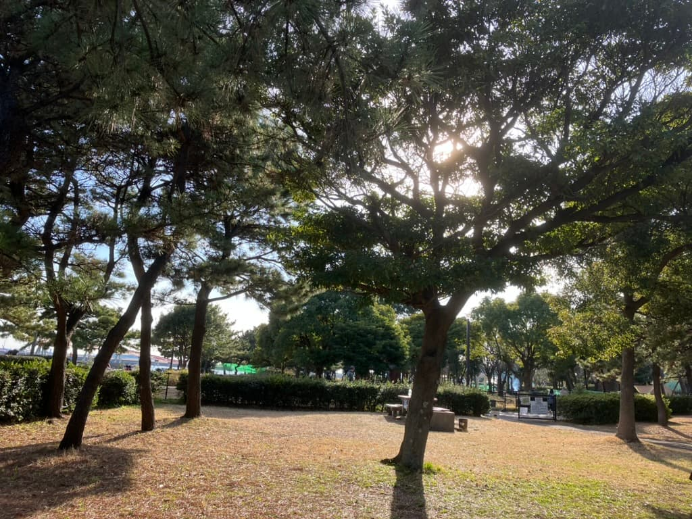

# 仕事

2022年10月に転職をした。もう1年と少し立つのが驚き。

## 1月〜

転職してから1月までは細かい改善要望のタスクをこなして開発に慣れていく段階だったが、今年に入ってからはプロジェクトに入って新機能の開発を行った。
マイクロサービス化と同時に進んでいたが新機能だけでもかなり難しかったので途中でマイクロサービス化は中止になった。
しかしDockerでBFFを作成するなどの技術的なことを学べたので良かった。

## 4月〜

4月5月は新機能を展示会に出展することとなり、そのためのプレビュー開発に勤しんでいた。メンバーの中ではこの期間がかなり大変だったといっていたし、自分もかなり大変だった。しかし展示会で無事にプレビューを披露できたので良かった。

## 〜7月

このあたりは最初のリリースに向けての開発期間だった。自分的にはこの期間が一番つらかった。開発メンバーがみな優秀なのでかなり助かっていたなと思った。

## 〜12月

最初のリリースに続いて細かいアップデートを重ねていく期間だった。この期間で少しだけフロントエンドの実装をしたり、現在進行系でQAのタスクにも取り組めているのでとても学びが多い。

## まとめ

転職して1年経ったことで環境に慣れたことが実感できた。途中でチーム編成が大きく変わったことでこれまで毎日話していたメンバーと別れてしまったのは結構悲しかった。
開発に関しては、Ruby / Ruby on Railsに関してかなり知識が深まった年になったなと感じた。来年はプロジェクト以外にも手を出して影響範囲を広げていきたい。
